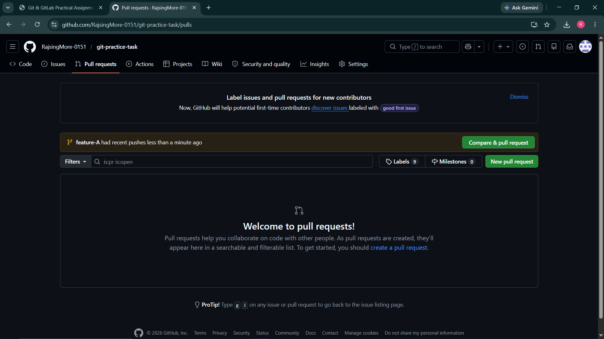
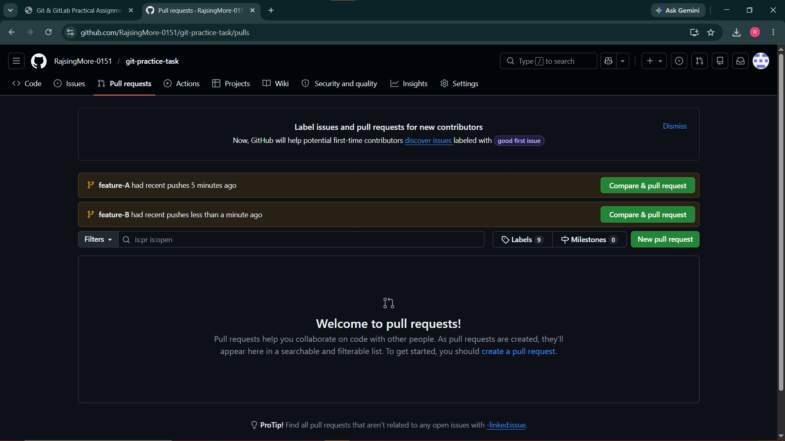
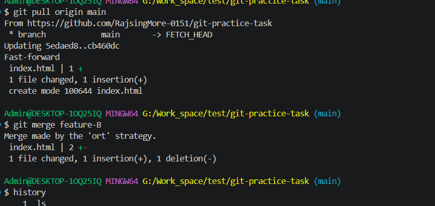
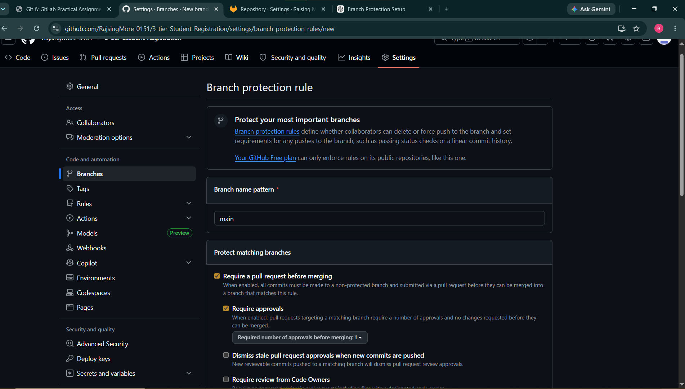

# Git & GitLab Practical Assignment

**Name:** Rajsing More

**Batch Name:** 18 May Devops

**Course Name:** MCA

---

# Task Completion Summary

## Task 1: Create GitHub Repository

* Created a public GitHub repository named **git-practice-task**.
* Initialized the repository with a README.md file.

## Task 2: Clone Repository

* Cloned the repository to the local machine using Git.
* Verified successful cloning.
* Navigated to the project directory.

## Task 3: Initial Development on Main Branch

* Updated README.md with:

  * Assignment Title
  * Student Name
  * Batch Name
  * Course Name
* Committed the changes.
* Pushed the changes to GitHub.

## Task 4: Create Feature-A Branch

* Created a new branch named **feature-A**.
* Added **index.html** with sample HTML content.
* Committed and pushed the branch to GitHub.

## Task 5: Create Pull Request

* Created a Pull Request:

  * feature-A → main
* Kept it open for review.

## Task 6: Create Feature-B Branch

* Created a new branch named **feature-B**.
* Modified the same section of **index.html** to intentionally create a future merge conflict.
* Committed and pushed changes.
* Created Pull Request:

  * feature-B → main

## Task 7: Merge Feature-A

* Reviewed and merged the Pull Request from feature-A into main.
* Verified successful merge.

## Task 8: Handle Merge Conflict

* Attempted to merge feature-B.
* Observed merge conflict.
* Pulled latest changes from main.
* Resolved conflict manually.
* Committed and pushed the resolved code.

## Task 9: Complete Merge

* Successfully merged feature-B into main.
* Verified both feature changes were available in the main branch.

## Task 10: Fork and Contribute

* Forked a public GitHub repository.
* Cloned the fork locally.
* Modified README.md.
* Pushed changes to fork.
* Created a Pull Request.

## Task 11: GitLab Repository Setup

* Created a private GitLab repository.
* Cloned repository using SSH.
* Created project structure:

```text
project/
├── src/
│   └── app.py
├── docs/
│   └── guide.md
└── README.md
```

* Committed and pushed the project structure.

## Task 12: Repository Mirroring

* Configured GitLab Repository Mirroring.
* Used GitHub repository as mirror target.
* Verified automatic synchronization between GitLab and GitHub.

## Task 13: Branch Protection

* Enabled branch protection on the main branch.
* Restricted direct pushes.
* Allowed modifications only through Pull Requests.
* Verified direct push attempts were blocked.

## Task 14: Final Verification

| Task                         | Status |
| ---------------------------- | ------ |
| GitHub Repository Created    | ✅      |
| Repository Cloned Locally    | ✅      |
| Feature Branches Created     | ✅      |
| Pull Requests Created        | ✅      |
| Pull Requests Merged         | ✅      |
| Merge Conflict Resolved      | ✅      |
| Fork Created and Updated     | ✅      |
| GitLab Repository Configured | ✅      |
| Repository Mirroring Working | ✅      |
| Branch Protection Enabled    | ✅      |

---

# Screenshots

## Pull Requests



## Merge Conflict Resolution





---

## Forked Repository


---

## Branch Protection Rules



---

# Commands Used

```bash
git clone <repository-url>

git checkout -b feature-A
git add .
git commit -m "Added index.html in feature-A"
git push origin feature-A

git checkout -b feature-B
git add .
git commit -m "Modified index.html in feature-B"
git push origin feature-B

git pull origin main

git add .
git commit -m "Resolved merge conflict"
git push origin feature-B
```

---

# Conclusion

This practical assignment demonstrated Git and GitLab workflows including repository management, branching strategies, pull requests, merge conflict resolution, repository forking, GitLab repository creation, repository mirroring, and branch protection implementation. All tasks were completed successfully and verified.
